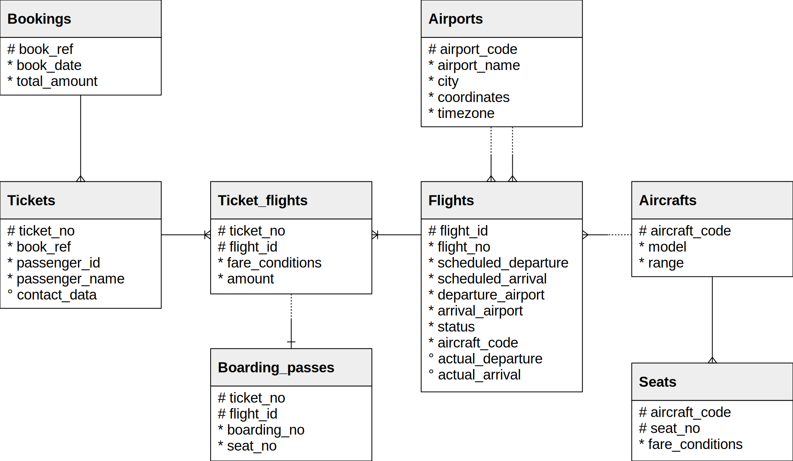

# Postgresql

Process of installing:
Download the installer from [Download Link](https://www.postgresql.org/download).
Make sure to select the correct operating system, and the version required for your purposes. Currently the latest version is 16.1.

After downloding the installer, the installation process is straightforward.
The port is `5432`, set the password and the directory you want to install.

After the installation is complete make sure that the `bin` and `lib` files are added to the `PATH` so the commands are accessible through terminal/shell.

### Mac/Linux
For Mac execute the following command in the terminal:
> export PATH="/Applications/Postgres.app/Contents/Versions/16/bin:$PATH"

For Linux:
``` sh
vi ~/.bashrc
PGHOME=/usr/local/postgresql
export PGHOME
PGDATA=/usr/local/postgresql/data
export PGDATA
PATH=$PATH:$HOME/.local/bin:$HOME/bin:$PGHOME/bin
export PATH
```
### Windows
Follow the path: 
> This PC -> properties -> Advanced System Settings -> Environment Variables -> PATH -> Edit

and then add the following lines:
>  ;C:\PostgreSQL\16\bin; C:\PostgreSQL\16\lib

Add following directories to the PATH.


Now you can use both pgadmin or SQL Shell(psql) to interact with postgresql.

## Setting up the database
Downlaod the demo database from the [Link](https://postgrespro.com/community/demodb).

I have download the demo-small-en.zip (21 MB) — flight data for one month (DB size is about 300 MB).
Extract and then run the following line:
> psql -f demo_small_YYYYMMDD.sql -U postgres
In my case command was:
> psql -f demo-small-en-20170815 -U postgres


Here is the ERD diagram I used to understand the structure of the database:



Here are some commands for psql:
\l (or \list): List all databases.

\c (or \connect): Connect to a different database.

\dt: List all tables in the current database.

\d table_name: Show details about a specific table.

\du: List all database users (roles).

\di: List all indexes in the current database.

\df: List all functions in the current database.

\dp: Show access privileges on database objects.

\q:  Quit psql.
